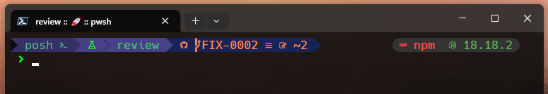

# Hello World! 👋

I'm Evandro Damaso - full stack developer.

<!-- [@Rocketseat](https://www.rocketseat.com.br/) Explorer T3 -->

  

#### Skills:

  

<!-- div>
   &nbsp;
   &nbsp;
   &nbsp;
   &nbsp;
   &nbsp;
   &nbsp;
   &nbsp;
   &nbsp;
   &nbsp;

 

  
⚡Github Stats

  
  
  
  

  <!-- Contador de visitas -->
  

<!-- details>
  
🪛 Stack

  <h3>My stack</h3>

  
🏷️Holopins

  
  

<!--

  
💻 Oh My Posh theme

  

    My custom 
    <a href="https://gist.github.com/dam450/460bed707799527cda65f6d151852ce0">Oh My Posh theme</a> 
    (needs a nerd font to fully work)
     
    
  

- Bachelor of Computer Science

- Python :snake:

- HTML

- CSS

- JavaScript

 
the features of **Git** and **GitHub** 
 
and Frontend too

**dam450/dam450** is a ✨ _special_ ✨ repository because its `README.md` (this file) appears on your GitHub profile.

Here are some ideas to get you started:

- 🔭 I’m currently working on ...
- 🌱 I’m currently learning ...
- 👯 I’m looking to collaborate on ...
- 🤔 I’m looking for help with ...
- 💬 Ask me about ...
- 📫 How to reach me: ...
- 😄 Pronouns: ...
- ⚡ Fun fact: ...

pandao.github.io/editor.md/en.html
-->

